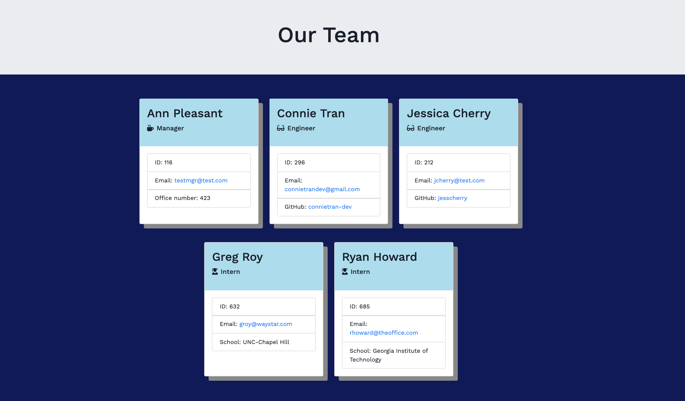

# Team Employee Summary - Template Engine: OOP & ES6

## Application Description

This application is a Node command line application that takes in information about team members & employees of a software engineering team and generates an HTML webpage that displays summaries for each team member. 

One of the most important aspects of programming is writing code that is readable, reliable, and maintainable. Oftentimes, *how* we design our code is just as important as the code itself. Since testing is a key piece in making code maintainable, this application also includes a suites of Jest unit tests. And the development of this project was focused on test-driven development.

The live page can be viewed on GitHub Pages here: https://connietran-dev.github.io/team-page-generator/index.html




## Usage

### User input

This Node CLI will prompt you to generate a webpage for your software engineering team. The application will prompt you for information about the team manager and then information about the team members. You can input any number of team members, including a mix of engineers and interns. Validation is implemented to ensure that information provided is in the proper expected format.

### Roster output

When you have completed building the team, the application then generates an `index.html` page in the `docs/` directory, that displays a nicely formatted team roster based on the information you provided. Each team member displays the following:

  * Name
  * Role
  * ID
  * Role-specific property (office number, link to GitHub profile, or university)
  

## Installation

To generate your own HTML team page, first download the repository and run `npm install` in order to install the following npm package dependencies as specified in the [`package.json`](https://github.com/connietran-dev/team-page-generator/blob/master/package.json):

* [`inquirer`](https://www.npmjs.com/package/inquirer) will prompt the user for the team member's email, id, and specific information based on their role with the company. For instance, an intern may provide their school, whereas an engineer may provide their GitHub username.
* [`jest`](https://jestjs.io/) will run unit tests to ensure that the `Employee`, `Manager`, `Engineer`, and `Intern` objects are generated from their classes correctly.

Once you have `npm install` your dependencies, you can run the Node CLI application with `npm start` which will begin the questions about your engineering team. You can run the tests at any time with `npm test`.


## Methodology

### Directory Structure

The directory structure of the application is as follows:

```
docs/          // Rendered HTML output that will appear on GitHub pages
lib/           // Employee classes as well as helper code to generate HTML
templates/     // Templates for main HTML <body> and employee <div>s
test/          // Jest tests
questions.js   // Inquirer prompts
app.js         // Runs the application and main functions
```

The `templates/` directory contains the `main.html` template for the main `<head>` and `<body`> as well as multiple HTML templates with placeholder characters that are identified with `Regex` for where dynamic markup begins and ends for each type of employee: 

  * `engineer.html`
  
  * `intern.html`
  
  * `manager.html`


### Classes

This application utilizes JavaScript's brand of object-oriented programming by using constructors, the prototype chain, and the `ES6` pattern of `class`. 

The different employee types, `Manager`, `Engineer`, and `Intern`, inherit methods and properties from a base class of `Employee`.

The first class is an `Employee` parent class with the following properties and methods:

  * name
  * id
  * email
  * role
  * getName()
  * getId()
  * getEmail()
  * getRole() // Returns 'Employee'

The other three classes extend `Employee`. In addition to `Employee`'s properties and methods, `Manager` also has:

  * officeNumber
  * getRole() // Overridden to return 'Manager'

In addition to `Employee`'s properties and methods, `Engineer` also has:

  * github  // GitHub username
  * getGithub()
  * getRole() // Overridden to return 'Engineer'

In addition to `Employee`'s properties and methods, `Intern` also has:

  * school 
  * getSchool()
  * getRole() // Overridden to return 'Intern'

### Test-Driven Development (TDD)

The development of this application focused on writing tests and ensuring application features passed to ensure code was understandable and maintainable. The methods on the classes were also developed to be as simple and pure as possible so that they are easier to test. The suite of `Jest` tests for the above classes in the `tests/` directory currently pass. Ultimately, these tests serve as fail-safes for future maintenance of the code base.

### Original Comps

Below were the original comps that mocked up what the application might look like.


The styling of the generated HTML has since then been customized. Cheers!